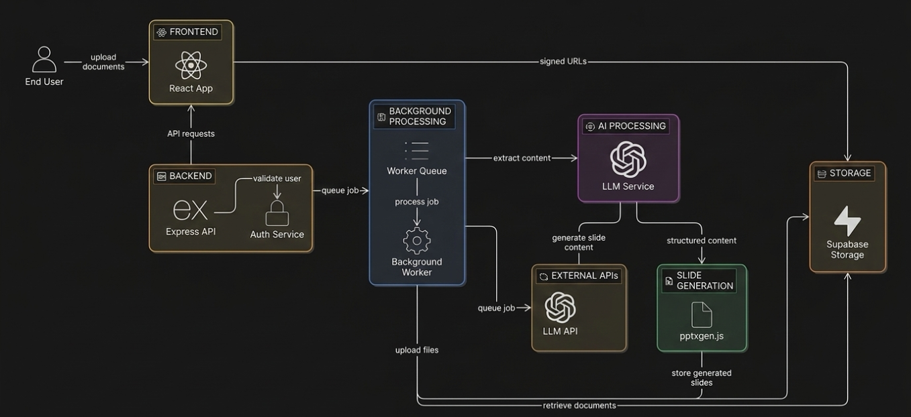
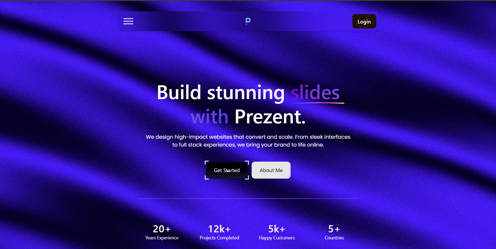
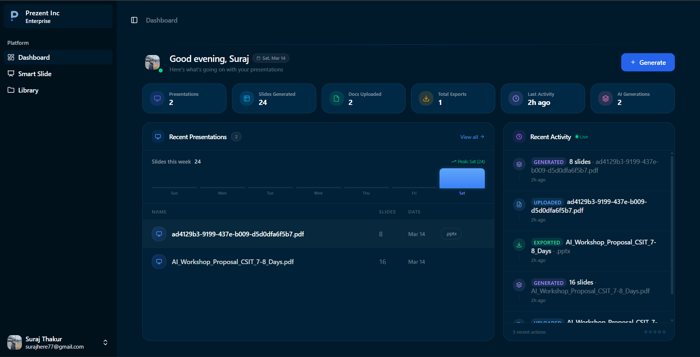
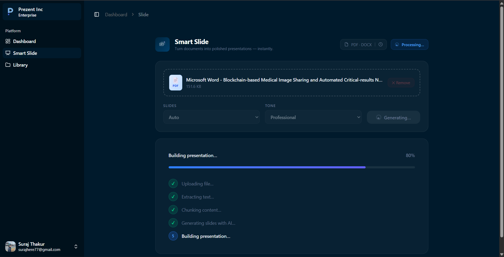

# 🖥️ Prezent

**Prezent** is a full-stack web application that transforms raw documents into structured, professional PowerPoint presentations using AI. Users upload their files through a clean React interface, and the system automatically extracts key content, structures it intelligently, and generates a downloadable `.pptx` file all without any manual slide work.

Built to demonstrate end-to-end system design: real-time auth, async background job processing, map-reduce style processing, LLM integration, and cloud storage all working together seamlessly.


## ✨ Features

- **Document Upload**: Upload `PDFs` or `DOCX` via a modern React UI
- **Content Extraction**: Uses `pdfjs-dist` to extract and structure key information from uploaded files
- **Async Job Queue**: Background workers handle heavy processing, keeping the UI fast and responsive
- **Chunking**: Large documents are split into fixed-size chunks and processed via a map-reduce strategy for accurate, section-level AI extraction
- **Automated Slide Generation**: Sends data to the LLM (Llama-3.1-8B-Instruct:novita), which converts the structured AI output into a fully formatted .pptx file using `pptxgenjs`.
- **Cloud Storage**: Presentations are stored in Supabase Storage and served via signed URLs
- **Authentication**: Secure user validation before any job is processed

---

## 🧩 Chunking Algorithm (How Large PDFs Are Processed)
 
Large documents cannot be passed to an LLM in one shot, Context limits and loss of focus over long inputs lead to poor, generic output. Prezent solves this with a **fixed-size chunking + map-reduce** pipeline that ensures every section of your document gets dedicated, high-quality attention from the model.
 
### Why Chunking?
 
Sending an entire 40-page PDF to an LLM in a single prompt causes the model to skim and generalize. By isolating content into focused chunks, the LLM extracts precise, section-specific insights which leads directly to better, more relevant slides.
 
### The Pipeline
 
```
Raw PDF
  │
  ▼
┌─────────────────────────────────────────────┐
│           STEP 1: TEXT EXTRACTION           │
│  Extract raw text from PDF (page by page)   │
└─────────────────────┬───────────────────────┘
                      │
                      ▼
┌─────────────────────────────────────────────┐
│           STEP 2: FIXED-SIZE CHUNKING       │
│                                             │
│  Split text into chunks of N tokens         │
│                                             │
│  [ Chunk 1 ] [ Chunk 2 ] [ Chunk 3 ] ...    │
│   ~500 tok    ~500 tok    ~500 tok           │
└─────────────────────┬───────────────────────┘
                      │
                      ▼
┌─────────────────────────────────────────────┐
│         STEP 3: MAP — Process Each Chunk    │
│                                             │
│  For each chunk → LLM prompt:               │
│  "Extract key points, facts, and topics"    │
│                                             │
│  Chunk 1 ──▶ Summary 1                      │
│  Chunk 2 ──▶ Summary 2                      │
│  Chunk 3 ──▶ Summary 3                      │
└─────────────────────┬───────────────────────┘
                      │
                      ▼
┌─────────────────────────────────────────────┐
│        STEP 4: REDUCE — Combine & Structure │
│                                             │
│  All summaries → Final LLM prompt:          │
│  "Organize into a coherent slide structure" │
│                                             │
│  Output: structured JSON slide content      │
└─────────────────────┬───────────────────────┘
                      │
                      ▼
┌─────────────────────────────────────────────┐
│        STEP 5: SLIDE GENERATION             │
│  Structured JSON → pptxgenjs → .pptx file  │
└─────────────────────────────────────────────┘
```
 
### Chunk Size Strategy
 
| Document Size | Chunk Size | Why |
|---|---|---|
| < 5 pages | No chunking | Fits within LLM context window |
| 5–20 pages | ~500 tokens/chunk | Balanced extraction per section |
| 20+ pages | ~300 tokens/chunk | Finer granularity, avoids info loss |
 
### Key Design Decisions
 
- **Fixed-size over semantic chunking** — Simpler to implement and deterministic; no dependency on NLP parsers or heading detection, which can be unreliable across varied PDF formats.
- **Map before Reduce** — Each chunk is summarized *independently* before combining. This prevents earlier content from dominating the final output — a common failure mode when long documents are summarized in a single pass.
- **Structured JSON output from Reduce step** — The final LLM call is prompted to return a strict JSON schema (title, bullet points per slide), making the handoff to `pptxgenjs` clean and predictable.
 
---

## 🏗️ Architecture



### Flow Summary

1. **User uploads** a document via the React frontend
2. **Express API** authenticates the user and queues a background job
3. **Background Worker** picks up the job and sends the document to the **LLM Service** to extract structured content
4. The structured content is passed to **pptxgenjs** for slide generation
5. The generated `.pptx` is **stored in Supabase Storage**
6. The frontend receives a **signed URL** to download the presentation

---

## 🛠️ Tech Stack

| Layer | Technology |
|---|---|
| Frontend | React + TypeScript +  Bun (runtime & bundler) |
| Backend API | Node.js + Express + Bun (runtime)|
| Authentication | JWT |
| Job Queue | Background Worker Queue |
| AI / LLM | Meta-LLaMA `Llama-3.1-8B-Instruct:novita` (via Hugging Face API, OpenAI-compatible client) |
| Slide Generation | pptxgenjs |
| Storage | Supabase Storage |

---

## 🚀 Getting Started

### Prerequisites

- Node.js `v18+`
- npm or yarn or bun
- Supabase account
- OpenAI API key

### Installation

```bash
# Clone the repository
git clone https://github.com/your-username/prezent.git
cd prezent

# Install dependencies for all services
npm install
```

### Environment Variables

Create a `.env` file in the root (and each service directory if applicable):

```env
# OpenAI
OPENAI_API_KEY=your_openai_api_key

# Supabase
SUPABASE_URL=your_supabase_project_url
SUPABASE_SERVICE_ROLE_KEY=your_service_role_key

# Auth
JWT_SECRET=your_jwt_secret

# App
PORT=5000
```

### Run Locally

```bash
# Start the backend API
bun dev

# Start the frontend
bun dev
```

---

## 📂 Project Structure

```
prezent/
├── client/                        # React + TypeScript frontend (Bun)
│   ├── src/
│   │   ├── Api/                   # API call definitions & Axios/fetch clients
│   │   ├── App/                   # Root app component & routing setup
│   │   ├── Assets/                # Static assets (images, icons, fonts)
│   │   ├── components/            # Shared reusable UI components
│   │   ├── features/              # Feature-based modules (upload, preview, etc.)
│   │   ├── hooks/                 # Custom React hooks
│   │   ├── lib/                   # Third-party library configs & wrappers
│   │   ├── pages/                 # Page-level route components
│   │   ├── Schemas/               # Zod / validation schemas
│   │   ├── States/                # Global state management (Zustand / Context)
│   │   ├── styles/                # Global CSS / Tailwind base styles
│   │   ├── types/                 # Shared TypeScript type definitions
│   │   └── utils/                 # Helper functions & utilities
│   ├── index.html
│   ├── main.tsx                   # App entry point
│   ├── slidePipeline.txt          # Slide generation prompt/pipeline notes
│   ├── components.json            # shadcn/ui component config
│   ├── eslint.config.js
│   ├── tsconfig.app.json
│   └── package.json               # Bun-managed dependencies
│
├── server/                        # Express API backend (Bun + TypeScript)
│   ├── src/
│   │   ├── config/                # App config (env vars, DB config, constants)
│   │   ├── controllers/           # Route handler logic (request → response)
│   │   ├── db/                    # Database client & connection setup
│   │   ├── middlewares/           # Auth, error handling, validation middleware
│   │   ├── models/                # Data models / DB schema definitions
│   │   ├── routes/                # Express route declarations
│   │   ├── schemas/               # Zod request/response validation schemas
│   │   ├── services/              # Business logic (chunking, LLM, storage calls)
│   │   ├── types/                 # Shared TypeScript type definitions
│   │   ├── utils/                 # Helper functions & utilities
│   │   ├── app.ts                 # Express app setup & middleware registration
│   │   ├── constant.ts            # App-wide constants
│   │   └── index.ts               # Server entry point
│   ├── nodemon.json
│   ├── tsconfig.json
│   └── package.json               # Bun-managed dependencies

```

---

## 🔑 Key Design Decisions

- **Async processing via job queue**: Slide generation is offloaded to a background worker so the API stays non-blocking and responsive under load.
- **Chunking Strategy**: Chunking splits large documents into manageable pieces so the LLM can process all content accurately and generate structured slides.
- **Supabase signed URLs**: Files are never exposed publicly; time-limited signed URLs ensure secure, controlled access per user.
- **Auth at the API layer**: All job creation is gated behind authentication, preventing unauthorized resource usage.

---

## 📸 Screenshots






---

## 🤝 Contributing

Pull requests are welcome! For major changes, please open an issue first to discuss what you'd like to change.

